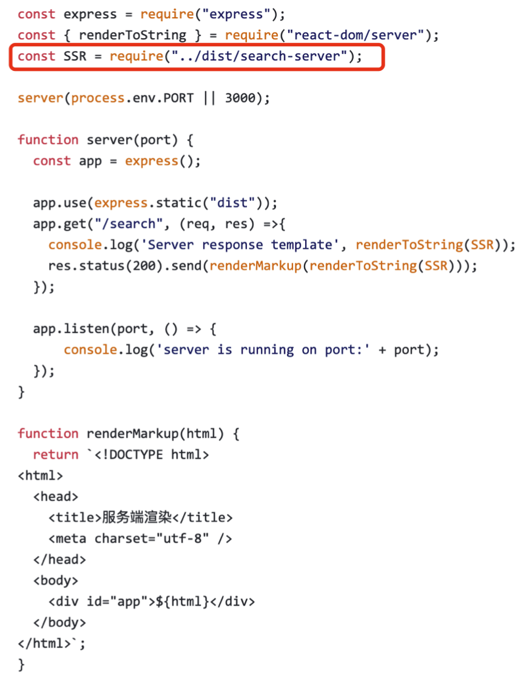
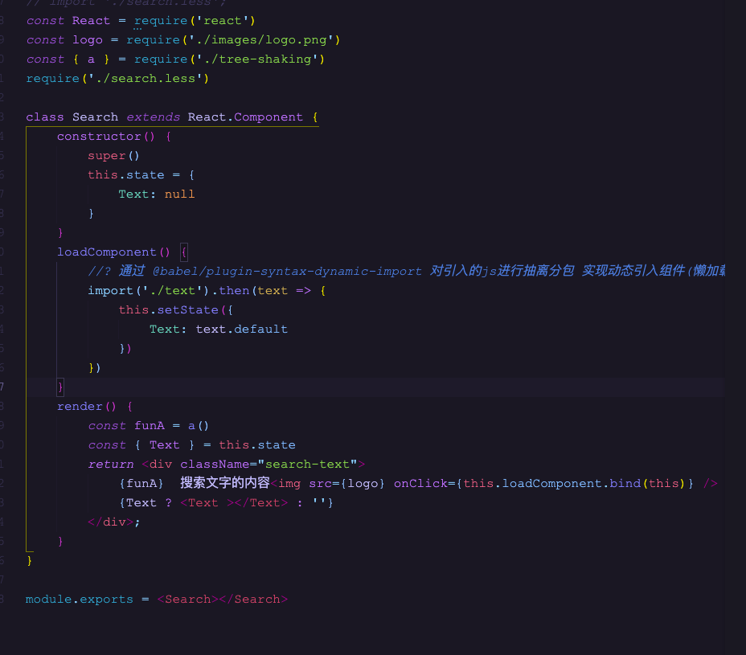
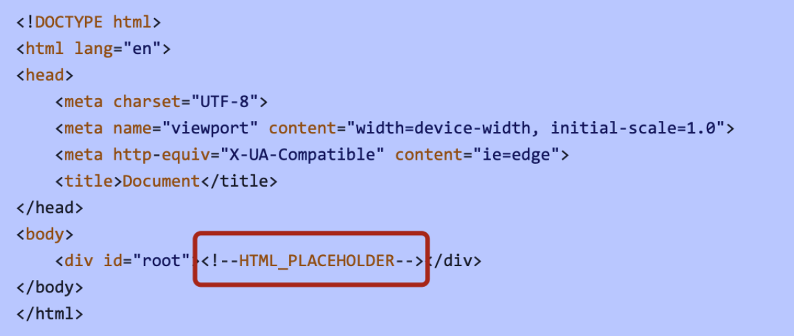

# 服务端渲染 (SSR) 是什什么?

## 渲染:

 HTML+CSS+JS+Data->渲染后的HTML

## 服务端:

* 所有模板等资源都存储在服务端
* 内⽹机器器拉取数据更更快 
* 一个 HTML 返回所有数据

# SSR 代码实现思路路

## 服务端

* 使⽤用 react-dom/server 的 renderToString ⽅方法将 React 组件渲染成字符串串

* 服务端路路由返回对应的模板

## 客户端 

* 打包出针对服务端的组件

## webpack ssr 打包存在的问题

* 浏览器的全局变量 (Node.js 中没有 document, window) 
* 组件适配:将不不兼容的组件根据打包环境进⾏行行适配
* 请求适配:将 fetch 或者 ajax 发送请求的写法改成 isomorphic-fetch 或者 axios

## 样式问题 (Node.js ⽆无法解析 css) 

* ⽅案一:服务端打包通过 ignore-loader 忽略掉 CSS 的解析
* ⽅案二:将 style-loader 替换成 isomorphic-style-loader

## 如何解决样式不不显示的问题?

* 使⽤打包出来的浏览器端 html 为模板 
* 设置占位符，动态插⼊入组件

//server.js修改：
const fs=require('fs')
const path =require('path')
const express = require('express')
const { renderToString } = require('react-dom/server')//? 这个是把react 组件转成字符串的html代码
const SSR = require('../dist/search-server')
const template=fs.readFileSync(path.join(__dirname,'../dist/search.html'),'utf-8')

//? <!--HTML_PLACEHOLDER--> 这个可以自定义只是一个标志符
const renderMarkUp = (str) => {
    return template.replace('<!--HTML_PLACEHOLDER-->',str)
}

##  ⾸屏数据如何处理?

### 服务端获取数据

替换占位符:

跟插入strHtml一样替换一个标志符；替换为script标签；

    const data =require('./data.json')

    //? <!--HTML_PLACEHOLDER--> 这个可以自定义只是一个标志符
    //? <!--INITIAL_DATA_PLACEHOLDER--> 数据替换位置的标志符
    const renderMarkUp = (str) => {
        const dataStr=JSON.stringify(data)
        return template.replace('<!--HTML_PLACEHOLDER-->',str)
        .replace('<!--INITIAL_DATA_PLACEHOLDER-->',``)
    }