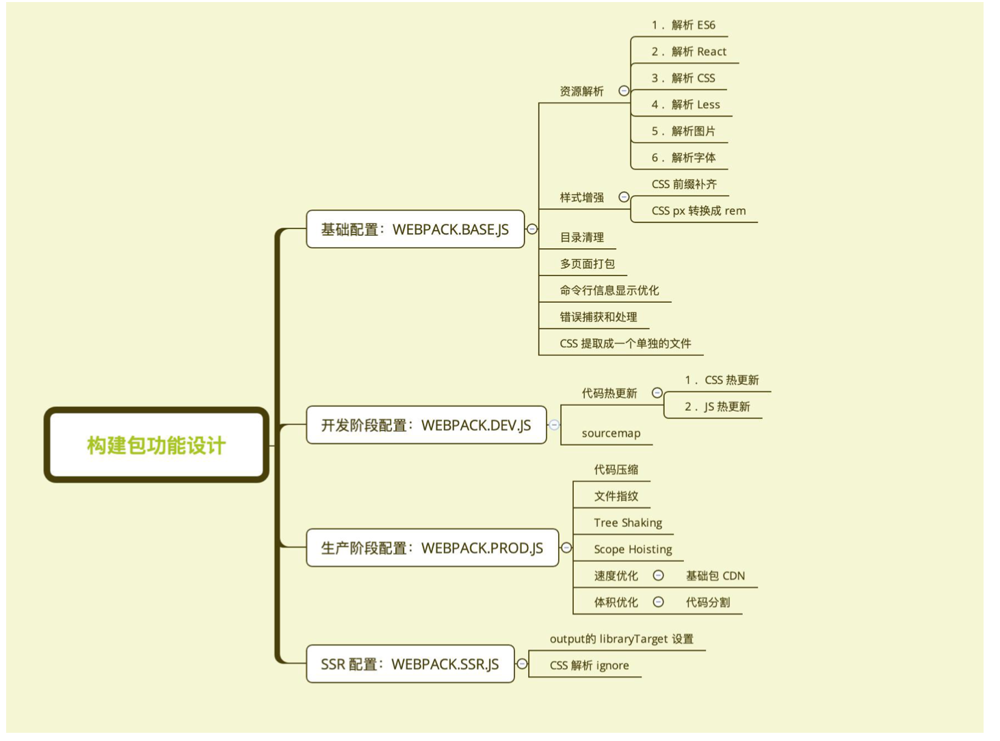

# 构建配置抽离成 npm 包的意义

## 通用性

* 业务开发者无需关注构建配置
* 统一团队构建脚本

## 可维护性

* 构建配置合理的拆分
* README 文档、ChangeLog 文档等

## 质量 

* 冒烟测试、单元测试、测试覆盖率
* 持续集成

# 构建配置管理的可选方案

* 通过多个配置文件管理不同环境的构建，webpack --config 参数进行控制 

* 将构建配置设计成一个库，比如:hjs-webpack、Neutrino、webpack-blocks

* 抽成一个工具进行管理，比如:create-react-app, kyt, nwb 

* 将所有的配置放在一个文件，通过 --env 参数控制分支选择

# 构建配置包设计

## 通过多个配置文件管理不同环境的 webpack 配置 

* 基础配置:webpack.base.js
  
* 开发环境:webpack.dev.js
  
* 生产环境:webpack.prod.js
  
* SSR环境:webpack.ssr.js 
  
* .....

## 抽离成一个 npm 包统一管理

* 规范:Git commit日志、README、ESLint 规范、Semver 规范
* 质量:冒烟测试、单元测试、测试覆盖率和 CI

## 通过 webpack-merge 组合配置

    > merge = require("webpack-merge") 
    > ...
    > merge(
    ... { a: [1], b: 5, c: 20 },
    ... { a: [2], b: 10, d: 421 }
    ... )
    { a: [ 1, 2 ], b: 10, c: 20, d: 421 }

合并配置:

    module.exports = merge(baseConfig, devConfig);

# 功能模块设计：

# 目录结构设计

* lib 放置源代码

* test 放置测试代码

    |- /test 
    |- /lib
        |- webpack.dev.js 
        |- webpack.prod.js 
        |- webpack.ssr.js 
        |- webpack.base.js
    |- README.md
    |- CHANGELOG.md 
    |- .eslinrc.js
    |- package.json
    |- index.js

# 使用 ESLint 规范构建脚本

## 使用 eslint-config-airbnb-base 

eslint --fix 可以自动处理空格

 "scripts": {
    "test": "echo \"Error: no test specified\" && exit 1",
    "eslint":"eslint --fix"
  },

## 配置：

### 安装依赖：

**cnpm i eslint babel-eslint eslint-config-airbnb-base -D**

### 增加配置：

    module.exports = {
        "parser": "babel-eslint", 
        "extends": "airbnb-base", 
        "env": {
            "browser": true,
            "node": true 
        }
    };

### 运行： yarn eslint 

* 自动修复空格换行相关报错；
* 提示其他的 语法错误

### 禁用某一行的检查：

//这行的检测会被跳过
console.log('23123)//eslint-disable-line