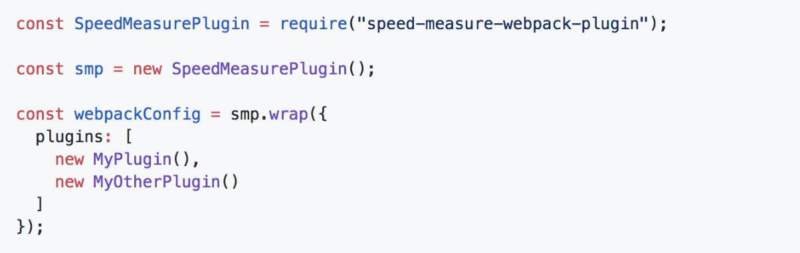
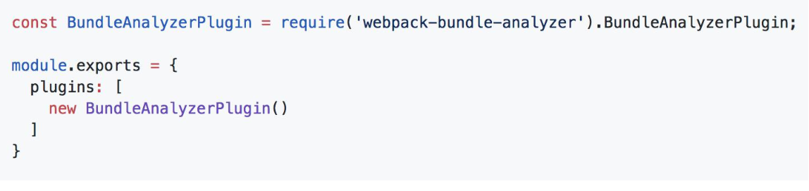

## 增加script 命令：
 "build:stats": "webpack --config webpack.prod.js --json > stats.json"

 ## 运行后会生成stats.json 文件；

 ## 速度分析:使用 speed-measure-webpack-plugin
 代码示例

可以看到每个 loader 和插件执行耗时

## webpack-bundle-analyzer 分析体积

