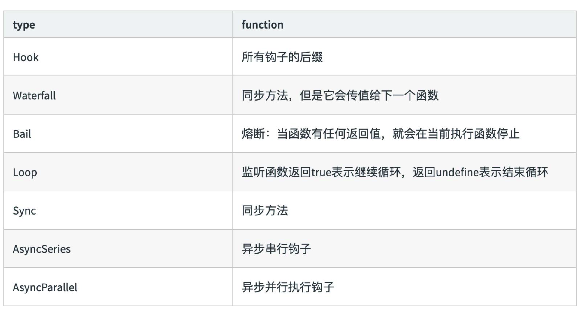

# 核心对象 Compiler 继承 Tapable

    class Compiler extends Tapable {
        // ... 
    }

# 核心对象 Compilation 继承 Tapable

    class Compilation extends Tapable {
        // ... 
    }
# Tapable 是什么?

Tapable 是一个类似于 Node.js 的 EventEmitter 的库, 主要是控制钩子函数的发布 与订阅,控制着 webpack 的插件系统。

## Tapable库暴露了很多 Hook(钩子)类，为插件提供挂载的钩子

    const {
        SyncHook,//同步钩子 
        SyncBailHook, //同步熔断钩子：遇到return 直接返回
        SyncWaterfallHook, //同步流水钩子 ：执行结果可以传递给下一个插件
        SyncLoopHook, //同步循环钩子
        AsyncParallelHook, //异步并发钩子 
        AsyncParallelBailHook, //异步并发熔断钩子
        AsyncSeriesHook, //异步串行钩子 
        AsyncSeriesBailHook, //异步串行熔断钩子
        AsyncSeriesWaterfallHook //异步串行流水钩子
    } = require("tapable");

## Tapable hooks 类型：

| type          | function                                                    |
| ------------- | ----------------------------------------------------------- |
| Hook          | 所有钩子的后缀                                              |
| Waterfall     | 同步方法，但是他的值回传给下一个函数                        |
| Bail          | 熔断：当函数有任何返回值，就会在当前执行函数停止            |
| Loop          | 监听函数返回 true 表示继续循环，返回 undefined 表示结束循环 |
| Sync          | 同步方法                                                    |
| AsyncSeries   | 异步串行钩子                                                |
| AsyncParallel | 异步并行执行钩子                                            |

## Tapable 的使用 -new Hook 新建钩子

* Tapable 暴露出来的都是类方法，new 一个类方法获得我们需要的钩子
* class 接受数组参数 options ，非必传。类方法会根据传参，接受同样数量的参数。

    const hook1 = new SyncHook(["arg1", "arg2", "arg3"]);

## Tapable 的使用-钩子的绑定与执行

Tabpack 提供了同步&异步绑定钩子的方法，并且他们都有绑定事件和执行事件对应的方法。

| Async*                        | Sync*      |
| ----------------------------- | ---------- |
| 绑定：tapAsync/tapPromise/tap | 绑定：tap  |
| 执行：callAsync/promise       | 执行：call |

## Tapable 的使用-hook 基本用法示例

    const hook1 = new SyncHook(["arg1", "arg2", "arg3"]);

    //绑定事件到webapck事件流

    hook1.tap('hook1', (arg1, arg2, arg3) => console.log(arg1, arg2, arg3)) //1,2,3

    //执行绑定的事件 hook1.call(1,2,3)

## Tapable 的使用-实际例子演示

定义一个 Car 方法，在内部 hooks 上新建钩子。分别是同步钩子 accelerate、 brake( accelerate 接受一个参数)、异步钩子 calculateRoutes

使用钩子对应的绑定和执行方法：

calculateRoutes 使用 tapPromise 可以返回一个 promise 对象

## Tapable 是如何和 webpack 联系起来的?

    if (Array.isArray(options)) {

        compiler = new MultiCompiler(options.map(options => webpack(options)));

    } else if (typeof options === "object") {

        options = new WebpackOptionsDefaulter().process(options); 
        compiler = new Compiler(options.context);
        compiler.options = options;
        new NodeEnvironmentPlugin().apply(compiler);//webpack插件必须有一个apply() 接受一个compiler对象

        if (options.plugins && Array.isArray(options.plugins)) {
            for (const plugin of options.plugins) {
                    if (typeof plugin === "function") {
                        plugin.call(compiler, compiler); //触发 hook
                        
                    } else { 
                        plugin.apply(compiler);

                    } 
            } 
        } 
        compiler.hooks.environment.call();//触发 hook
        compiler.hooks.afterEnvironment.call();//触发 hook
        compiler.options = new WebpackOptionsApply().process(options, compiler);
    }

## 模拟 Compiler.js

    const {
        SyncHook,
        AsyncSeriesHook//异步串行 hook
    } = require('tapable')

    module.exports = class Compiler { 
        constructor() {
            this.hooks = {
                accelerate: new SyncHook(['newspeed']), 
                brake: new SyncHook(),
                calculateRoutes: new AsyncSeriesHook(["source", "target", "routesList"])
            } 
        } 
        run(){ //触发 hook
            this.accelerate(10) 
            this.break()
            this.calculateRoutes('Async', 'hook', 'demo')
        } 
       //单独触发 不同 hook 
        accelerate(speed) {
            this.hooks.accelerate.call(speed);
        } 
        break() {
            this.hooks.brake.call();
        } 
        calculateRoutes() { 
            this.hooks.calculateRoutes.promise(...arguments).then(() => { }, err => {
                console.error(err);
            })
        }
    }

## 模拟插件 my-plugin.js

    const Compiler = require('./Compiler')

    class MyPlugin{ 
        constructor() {}

        apply(compiler){//监听 hook

            compiler.hooks.brake.tap("WarningLampPlugin", () => console.log('WarningLampPlugin')); 

            compiler.hooks.accelerate.tap("LoggerPlugin", newSpeed => console.log(`Accelerating to ${newSpeed}`));

            compiler.hooks.calculateRoutes.tapPromise("calculateRoutes tapAsync", (source, target, routesList)=> {

                return new Promise((resolve,reject)=>{ 
                    setTimeout(()=>{
                        console.log(`tapPromise to ${source} ${target} ${routesList}`)
                        resolve(); 
                        },1000)
                    });
            });

        } 
    }

## 模拟插件执行

    const myPlugin = new MyPlugin();//实例话 模拟插件对象
    const options = {//webpack 模拟配置
        plugins: [myPlugin] 
    }
    const compiler = new Compiler();//创建compiler对象

    for (const plugin of options.plugins) { 

        if (typeof plugin === "function") {
            plugin.call(compiler, compiler); 
        } else {
            plugin.apply(compiler); //监听 hook
        } 
    }
    compiler.run();