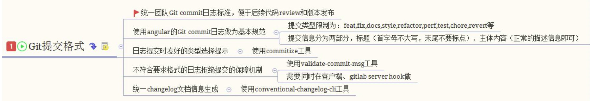
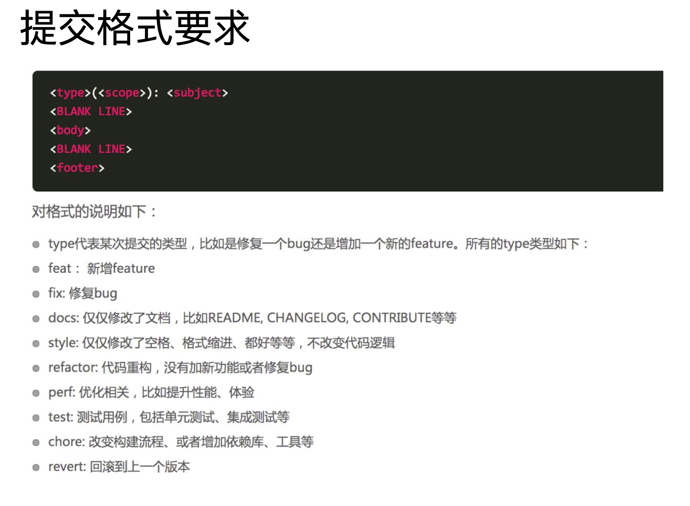

# Git 规范和 Changelog 生成

## 良好的 Git commit 规范优势:
* 加快 Code Review 的流程
* 根据 Git Commit 的元数据生成 Changelog
* 后续维护者可以知道 Feature 被修改的原因

# 本地开发阶段增加 precommit 钩子:检查git commit 是否规范

安装 husky
npm install husky --save-dev 

通过 commitmsg 钩子校验信息

    "scripts": {
        "commitmsg": "validate-commit-msg", 
        "changelog": "conventional-changelog -p angular -i CHANGELOG.md -s -r 0" 
    },
    "devDependencies": { 
        "validate-commit-msg": "^2.11.1", 
        "conventional-changelog-cli": "^1.2.0", 
        "husky": "^0.13.1"
    }

## Changelog 生成

# 开源项目版本信息案例
* 软件的版本通常由三位组成，形如: X.Y.Z* 
* 版本是严格递增的，此处是:16.2.0 - > 16.3.0 -> 16.3.1
* 在发布重要版本时，可以发布alpha, rc 等先行版本alpha和rc等修饰版本的关键字后面可 以带上次数和meta信息

# 遵守 semver 规范的优势

## 优势: 
* 避免出现循环依赖
* 依赖冲突减少

# 语义化版本(Semantic Versioning)规范格式

* 主版本号:当你做了不兼容的 API 修改， 

* 次版本号:当你做了向下兼容的功能性新增，

* 修订号:当你做了向下兼容的问题修正。

# 先行版本号
先行版本号可以作为发布正式版之前的版本，格式是在修订版本号后面加上一个连接 号(-)，再加上一连串以点(.)分割的标识符，标识符可以由英文、数字和连接号 ([0-9A-Za-z-])组成。

* alpha:是内部测试版，一般不向外部发布，会有很多 Bug。一般只有测试人员使用。 
* beta:也是测试版，这个阶段的版本会一直加入新的功能。在 Alpha 版之后推出
* rc:Release Candidate 系统平台上就是发行候选版本。RC 版不会再加入新的功能了，主 要着重于除错。
