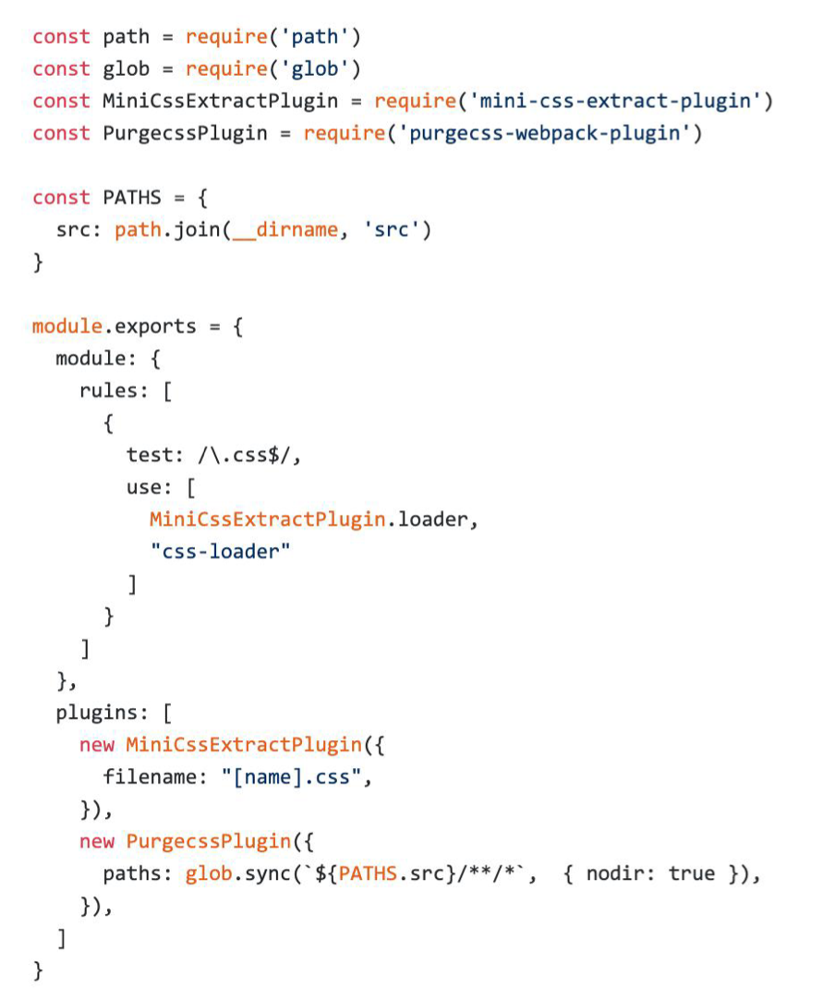

# 无用的 CSS 如何删除掉?

* PurifyCSS: 遍历代码，识别已经用到的 CSS class

* uncss: HTML 需要通过 jsdom 加载，所有的样式通过PostCSS解析，通过 document.querySelector 来识别在 html 文件里面不存在的选择器

## 在 webpack 中如何使用 PurifyCSS? 使用 purgecss-webpack-plugin 需要和 mini-css-extract-plugin 配合使用

· https://github.com/FullHuman/purgecss-webpack-plugin 

# 一般不会有无用的css，我们的dom 加载css可能是js动态加载的；所以不实用
