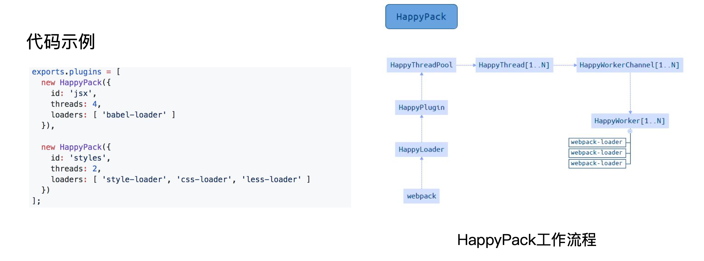
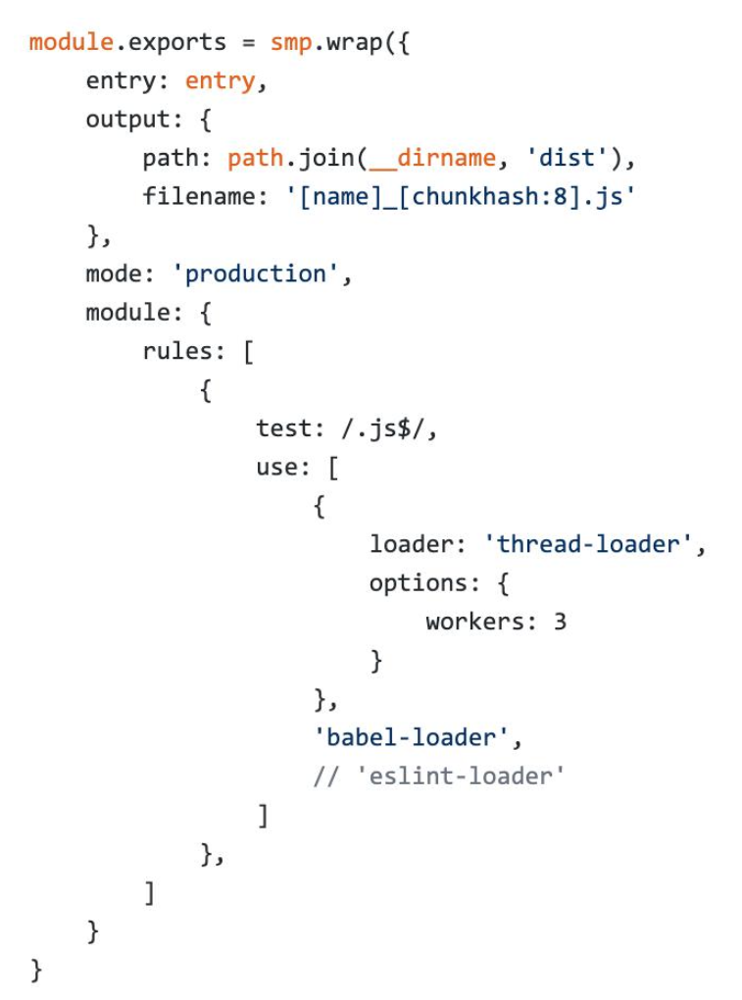
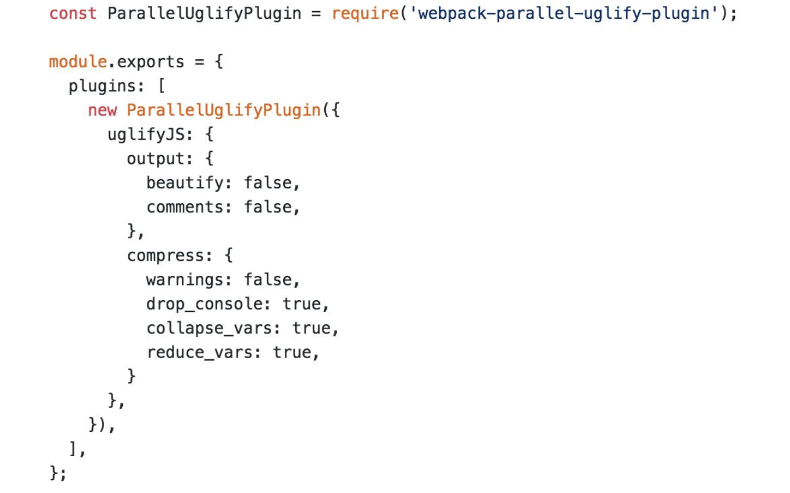
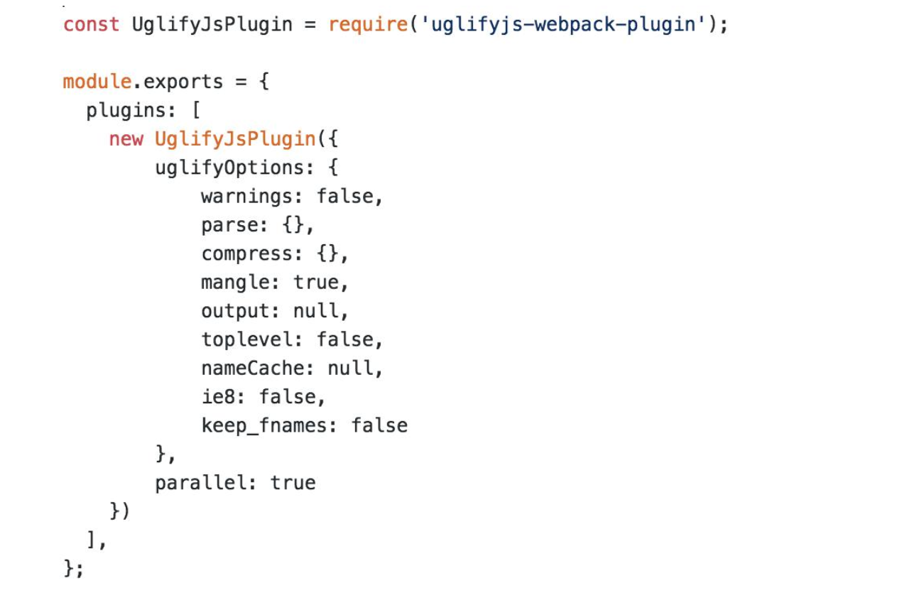
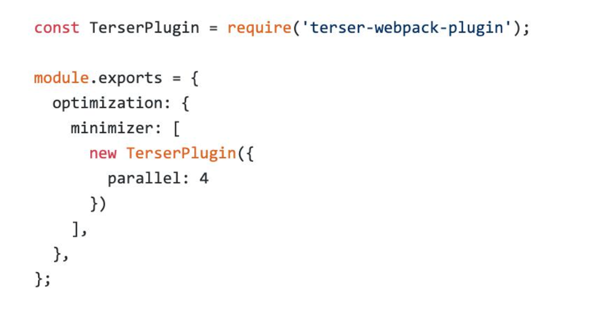

# 多进程/多实例构建:资源并行解析可选方案

## 多进程构建： thread-loader(官方提供) 、  HappyPack
## 并行压缩：   parallel-webpack 
 

## 多进程打包：

### 使用 HappyPack 解析资源

原理:每次 webapck 解析一个模块，HappyPack 会将它及它的依赖分配给 worker 线程中

### 使用 thread-loader 解析资源

原理:每次 webpack 解析一个模块，thread- loader 会将它及它的依赖分配给 worker 线程中

    npm install --save-dev thread-loader

    module.exports = {
        module: {
            rules: [
            {
                test: /\.js$/,
                include: path.resolve('src'),
                use: [
                'thread-loader',
                // your expensive loader (e.g babel-loader)
                ],
            },
            ],
        },
    };

##  并行压缩

方法一:使用 webpack-parallel-uglify-plugin 插件,代码压缩

方法二:uglifyjs-webpack-plugin 开启 parallel 参数；不支持压缩es6

方法三:terser-webpack-plugin 开启 parallel 参数：支持压缩es6 （推荐）

