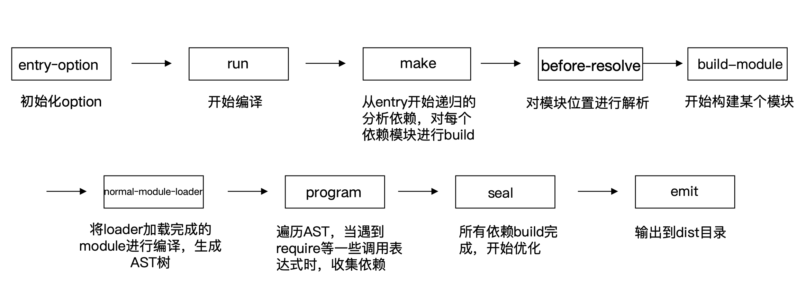

# webpack的编译都按照下面的钩子调用顺序执行

# Compiler hooks

流程相关:

* (before-)run 
* (before-/after-)compile 
* make
* (after-)emit
* done

监听相关:

* watch-run 
* watch-close

# Compilation

Compiler 调用 Compilation 生命周期方法

* addEntry -> addModuleChain 
* finish (上报模块错误)
* seal (内容输出资源优化)

### Compilation hooks

模块相关:
·build-module 
·failed-module 
·succeed-module

资源生成相关:

·module-asset 
·chunk-asset

优化和 seal相关:
·(after-)seal
·optimize 
·optimize-modules
(-basic/advanced) 
·after-optimize-modules
·after-optimize-chunks 
·after-optimize-tree
·optimize-chunk-modules (-basic/advanced)
·after-optimize-chunk-modules 
·optimize-module/chunk-order 
·before-module/chunk-ids
·(after-)optimize-module/ chunk-ids
·before/after-hash
